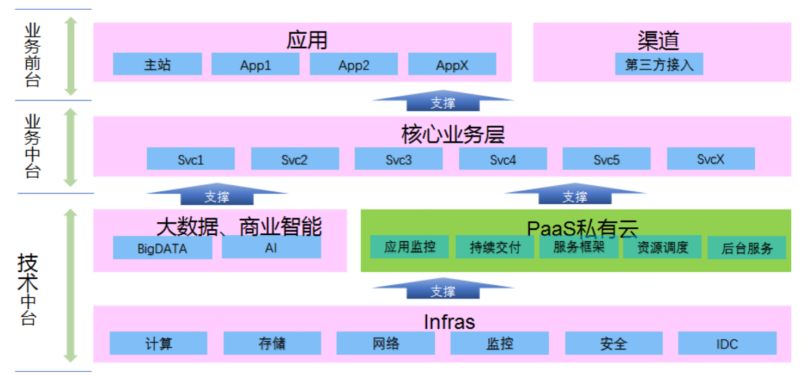

## Algorithm
给定两个字符串 s 和 t ，编写一个函数来判断 t 是否是 s 的字母异位词。
示例：
输入: s = "anagram", t = "nagaram"
输出: true
```Python
class Solution:
    def isAnagram(self, s: str, t: str) -> bool:
        dict1, dict2 = {}, {}
        for item in s:
            dict1[item] = dict1.get(item, 0) + 1
        for item in t:
            dict2[item] = dict2.get(item, 0) + 1
        return dict1 == dict2
```
---
## Review
### The JVM Architecture Explained
* JVM可以划分为3个子系统：类加载器子系统，运行时数据区，执行引擎
#### 类加载子系统
* 实现动态类加载功能
* 当在运行时而非编译期第一次引用一个类时，类加载子系统会加载，链接和初始化该类文件
* 加载：
    * Bootstrap ClassLoader：从Bootstrap类路径中加在rt.jar
    * Extension ClassLoader：加载jre\lib路径中的类
    * Application ClassLoader：加载应用级别路径以及环境变量中配置的路径中的类
* 类加载时遵循双亲委托算法
* 链接：
    * 验证：验证字节码文件的正确性
    * 准备：为所有静态变量分配内存并赋默认值
    * 解析：用方法区的实际引用替换所有内存中的符号引用
* 初始化：
    * 为所有的静态变量赋实际值，所有的静态块代码将被执行
#### 运行时数据区
1. 方法区：每个JVM只有一个方法区，所有类级别的数据会存于此区域，包括静态变量
2. 堆区：每个JVM只有一个堆区，数组、对象及其对应的实例变量存于此区域
3. 栈区：每个线程对应一个运行时栈，每次方法调用都会在栈中创建栈帧，所有的局部变量存于此区
    * 局部变量数组：存储方法中涉及的局部变量
    * 操作数栈：用来执行操作的运行时工作区
    * 帧数据：存储与方法对应的符号，发生异常时，捕捉块的信息会存于该区域
* 由于方法区和堆区是多线程共享的，所以存于该区域的静态变量、数组、对象及其实例变量并不是线程安全的
* 由于栈区是各线程独有的，所以存于此区域的局部变量是线程安全的
4. PC寄存器：每个线程对应一个PC寄存器，用于保存当前正在执行的指令的地址，执行完后PC寄存器会更新为下一条指令的地址
5. 本地方法栈：每个线程对应一个本地方法栈，用于存储本地方法信息
#### 执行引擎
* 解释器：解释器解释代码速度较快，执行代码速度较慢；同一个方法调用多次，每次都会进行解释操作
* JIT编译器：将多次重复调用的字节码编译成本地代码，该本地代码用于直接调用，从而提高了系统性能
    1. 中间代码生成器：生成中间代码
    2. 代码优化器：用于优化中间代码
    3. 目标代码生成器：用于生成机器码或本地代码
    4. 分析器：用于发现热点代码，判断方法的调用次数
#### 垃圾回收器
* 收集并移除未被引用的对象，用反射方式创建的对象会像其他对象一样被垃圾回收
#### Java本地接口（JNI）
* JNI与本地方法库关联，为执行引擎提供本地库
#### 本地方法库
* 为执行引擎提供的本地库集合
---
## Tip
### 通用线程生命周期
1. 初始状态：线程已被创建，还未分配给CPU执行，该状态是编程语言层面的状态，在操作系统层面真正的线程还未被创建
2. 可运行状态：线程可以分配给CPU执行，在操作系统层面线程已经被创建
3. 运行状态：操作系统将CPU时间片分配给线程，线程处于执行状态
4. 休眠状态：线程调用阻塞API或等待条件变量，则会进入休眠状态，同时释放CPU使用权（当阻塞API返回或条件满足时，线程进入可运行状态）
5. 终止状态：线程执行结束或出现异常则进入终止状态，意味着线程的生命周期结束
### Java中线程的生命周期
1. NEW（初始化状态）
2. RUNNABLE（可运行 / 运行状态）
3. BLOCKED（阻塞状态）
4. WAITING（无时限等待）
5. TIMED_WAITING（有时限等待）
6. TERMINATED（终止状态）
* 在操作系统层面，BLOCKED，WAITING，TIMED_WAITING都属于休眠状态，即当前没有获取CPU的使用权
### Java线程状态转换
1. RUNNABLE和BLOCKED
    * 只有线程等待synchronized隐式锁时才会从RUNNABLE转到BLOCKED状态，当等待的线程获得隐式锁时再变回RUNNABLE状态
    * 线程调用阻塞式API并不会使线程变为BLOCKED状态，依旧是RUNNABLE状态，但在操作系统层面会变为休眠状态，JVM层面并不关心操作系统层面的调度状态
    * 所谓的Java线程调用阻塞式API时线程会阻塞，其指的是操作系统线程的状态
2. RUNNABLE和WAITING
    1. 获得synchronized隐式锁的线程调用无参的Object.wait()方法会进入WAITING状态
    2. 线程调用Thread.join()方法会进入WAITING状态，该线程会等待Thread线程执行完后再变为RUNNABLE状态
    3. 当前线程调用LockSupport.park()方法会进入WAITING状态，当调用LockSupport.unpark(Thread thread)时可唤醒目标线程，使其变为RUNNABLE状态
3. RUNNABLE和TIMED_WAITING
    1. 调用带超时参数的Thread.sleep(long millis)方法
    2. 获得synchronized隐式锁的线程，调用带超时参数的Object.wait(long timeout)方法
    3. 调用带超时参数的Thread.join(long millis)方法
    4. 调用带超时参数的LockSupport.parkNanos(Object blocker, long deadline)方法
    5. 调用带超时参数的LockSupport.parkUntil(long deadline)方法
4. NEW和RUNNABLE
    * 创建线程（继承Thread对象并重写run()方法，或者，实现Runnable()接口并实现run()方法并将该实现类作为创建Thread对象的入参）并调用Thread.start()方法
5. RUNNABLE和TERMINATED
    * 线程执行完后和执行run()方法时抛出异常都会进入TERMINATED状态
    * 可以通过调用interrupt()和stop()方法来强制中断run()方法的执行
    * stop()方法被标记为@Deprecated，该方法中断线程时并不会释放线程所持有的锁，会造成其他线程一直无法获取该锁，所以不建议使用该方法
    * interrupt()通过异常或主动监测的方式使线程终止执行，线程有机会执行一些后续操作
        * 当线程处于WAITING、TIME_WAITED状态时，如果其他线程调用该线程的interrupt()方法，该线程会进入RUNNABLE状态，同时会触发InterruptException异常
        * 当线程处于RUNNABLE状态时，且阻塞在java.nio.channels.InterruptibleChannel上时，如果其他线程调用该线程的interrupt()方法，该线程会触发java.nio.channels.ClosedByInterruptException异常；而阻塞在java.nio.channels.Selector上时，如果其他线程调用该线程的interrupt()方法，该线程的java.nio.channels.Selector会立即返回
        * 当线程处于RUNNABLE状态，并且没有阻塞在某个I/O操作上，如果其他线程调用该线程的interrupt()方法，该线程可以通过isInterrupted() 方法来检测自己是不是被中断了
---
## Share


* IaaS（Infrastructure as a Service）基础设施即服务，IaaS云平台一般由基础运维团队负责，该平台提供底层基础设施，支撑整个技术研发
* PaaS（Platform as a Service）平台即服务
* 核心业务层：微服务化，抽象化的核心领域服务，向上支撑各个业务线交付业务应用
* 应用层：如PC主站，H5应用，APP等
* 第三方渠道通过API的方式对外提供业务能力的使用
* 阿里提出大中台小前台战略，统称为中台战略
* 大中台的意思是要强化作为基础设施的技术中台和业务中台
* 小中台的意思是让前端业务更小更灵活，根据市场变化和业务需求能够快速演化出新的应用
* 中台越加成熟完善，其对前台的支撑作用就越加强力
* 其最终目标是赋能业务持续创新，产生出丰富的业务模式，快速的响应市场需求